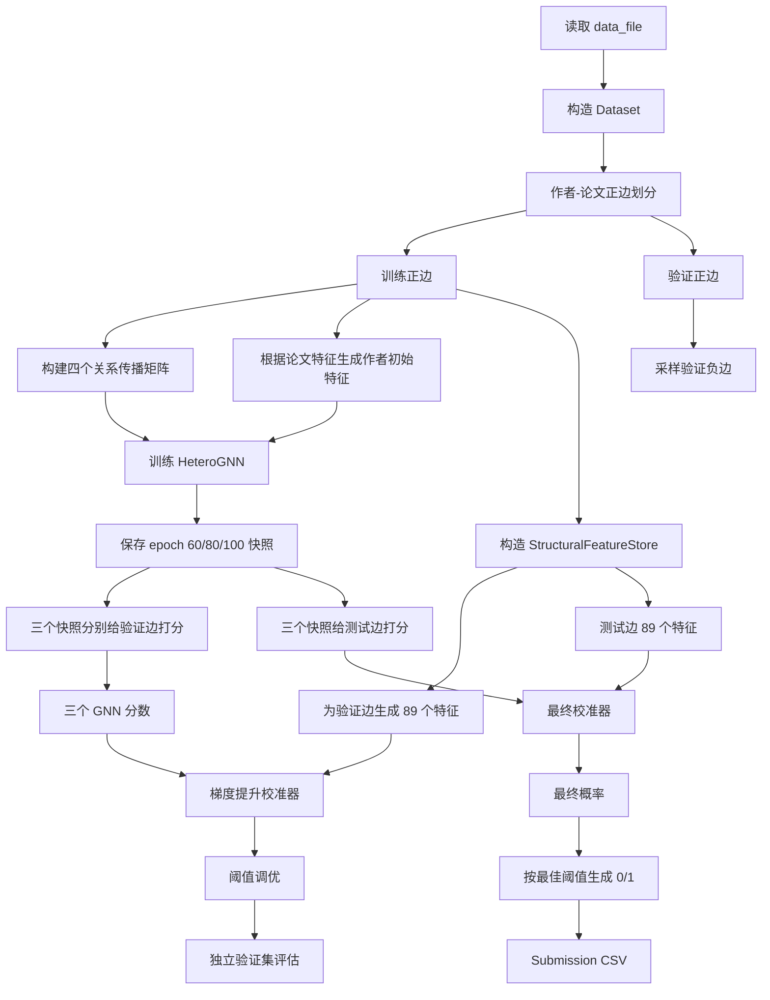

# 基于异构图神经网络的学术论文推荐系统：完整技术说明

## 1. 文档目的

本文档面向已经了解图神经网络（Graph Neural Network, GNN）基础概念，但尚不了解本项目具体实现的读者。

阅读完本文档后，应当能够回答以下问题：

1. 本项目到底要预测什么？
2. 作者、论文以及三类关系如何组成一个异构图？
3. `feature.pkl` 中的 512 维论文向量如何被模型使用？
4. HeteroGNN 如何分别处理作者-论文、作者-作者、论文-论文关系？
5. 为什么仅有 GNN 还不够，还要构造结构特征和语义特征？
6. 为什么训练到第 60、80、100 个 epoch 时分别保存快照？
7. 为什么最终还要训练一个梯度提升校准器？
8. 最终依据什么判断是否向某位作者推荐某篇论文？
9. `/src` 和 `/data_file` 中每个文件分别负责什么，它们如何前后连接？
10. 老师从零开始运行代码时，完整流程是怎样执行的？

本文档描述的是当前仓库中的实际实现，而不是一个脱离代码的概念方案。

---

## 2. 项目一句话概括

本项目将论文推荐问题转化为：

> 给定一名作者和一篇候选论文，预测作者与论文之间是否应当存在一条正向推荐关系。

从机器学习角度看，这是一个二分类问题；从图学习角度看，这是一个作者节点与论文节点之间的链接预测（link prediction）问题。

系统最终不是只依赖一个 GNN 分数，而是采用两阶段架构：

1. **表示学习阶段**：HeteroGNN 从三类图关系和 512 维论文特征中学习作者、论文嵌入，并输出作者-论文链接分数。
2. **融合决策阶段**：将第 60、80、100 epoch 的 GNN 分数与 89 个可解释的结构/语义特征融合，再由梯度提升校准器输出最终概率。

最终决策规则为：

```text
如果最终概率 >= 验证集上选出的最佳阈值，则 Predicted = 1；
否则 Predicted = 0。
```

当前完整复现实验得到的独立验证集结果约为：

| 指标 | 结果 |
| --- | ---: |
| F1 | 0.963534 |
| Accuracy | 0.963464 |
| AUC | 0.994153 |
| 最佳分类阈值 | 0.437 |

由于 CUDA 稀疏矩阵运算存在极小的浮点波动，不同完整运行的最后若干位可能不同，但当前两次从零运行均稳定得到约 `0.963` 的 F1。

该指标基于当前代码的行级随机划分。由于原始作者-论文文件存在重复 pair，同一 pair 的重复行可能跨越训练集和验证集，因此这个结果应理解为当前实验协议下的复现结果，而不是严格去重后的 pair-level 泛化结果。相关限制和改进方法见第 28.1 节。

---

## 3. 推荐任务的数学定义

### 3.1 节点集合

定义两种节点：

- 作者节点集合：\(\mathcal{A}\)
- 论文节点集合：\(\mathcal{P}\)

当前数据中：

```text
作者数量：6,611
论文数量：79,937
```

### 3.2 三类关系

系统使用三种关系：

1. 作者-论文关系：
   \[
   \mathcal{E}_{AP} \subseteq \mathcal{A} \times \mathcal{P}
   \]
   表示作者与论文之间已经观察到的正向关系。

2. 作者-作者关系：
   \[
   \mathcal{E}_{AA} \subseteq \mathcal{A} \times \mathcal{A}
   \]
   表示合作者或作者之间的关联。

3. 论文-论文关系：
   \[
   \mathcal{E}_{PP} \subseteq \mathcal{P} \times \mathcal{P}
   \]
   表示论文引用关系。

图模式可以表示为：

```text
作者 A_i  -------- 作者-作者关系 --------  作者 A_j
   |                                      |
   | 作者-论文关系                        | 作者-论文关系
   |                                      |
论文 P_m  -------- 论文-论文关系 --------  论文 P_n
```

这是一个**异构图（heterogeneous graph）**，因为图中同时存在多种节点类型和多种边类型。

### 3.3 预测目标

对于一个候选作者-论文对 \((a,p)\)，希望预测：

\[
y_{a,p} =
\begin{cases}
1, & \text{应当推荐或存在正向关系}\\
0, & \text{不应推荐或不存在正向关系}
\end{cases}
\]

模型首先输出连续分数或概率：

\[
\hat{q}_{a,p} \in [0,1]
\]

再使用验证集选出的阈值 \(t^\*\) 得到最终标签：

\[
\hat{y}_{a,p} = \mathbb{I}(\hat{q}_{a,p} \ge t^\*)
\]

这里的 \(\mathbb{I}\) 是指示函数。

---

## 4. 基础专业名词解释

### 4.1 图、节点和边

- **节点（node）**：图中的对象，本项目中是作者或论文。
- **边（edge）**：对象之间的关系，例如作者写过论文、作者之间合作、论文之间引用。
- **邻居（neighbor）**：与某节点通过一条边直接相连的节点。
- **度数（degree）**：一个节点连接的边数。

### 4.2 二部图

作者-论文图是二部图（bipartite graph）：

- 一侧只有作者节点；
- 另一侧只有论文节点；
- 作者-论文边只在两类节点之间连接。

### 4.3 异构图

异构图包含不同类型的节点或关系。本项目不仅有作者-论文边，还有作者-作者边与论文-论文边，因此不能简单地把所有关系当成完全相同的信息。

### 4.4 邻接矩阵

邻接矩阵用于表示图连接关系。若节点 \(i\) 与节点 \(j\) 相连，则邻接矩阵 \(A_{ij}\) 非零。

由于实际图中绝大多数节点对没有边，所以使用**稀疏矩阵（sparse matrix）**存储，仅记录非零位置，从而降低内存和计算开销。

### 4.5 消息传递

GNN 的基本思想是：

> 每个节点从邻居节点收集信息，再将邻居信息与自身信息组合，形成新的节点表示。

本项目中：

- 作者从其历史论文和合作者接收信息；
- 论文从其作者和相邻引用论文接收信息。

### 4.6 嵌入向量

嵌入（embedding）是对节点的低维向量表示。例如训练后，每个作者和论文都得到一个 64 维向量。向量中不再是直接可读的字段，而是模型学到的潜在模式。

### 4.7 链接预测

链接预测就是判断两个节点之间是否应该存在边。本项目判断的是作者节点与候选论文节点之间是否应当存在正向推荐链接。

### 4.8 负采样

训练文件只给出了已观察到的正边，而没有直接给出负边。为了训练二分类器，需要随机生成一些当前不在正边集合中的作者-论文对，将它们视为负样本。

这一过程称为负采样（negative sampling）。

### 4.9 Logit、概率和阈值

- **Logit**：模型在 sigmoid 之前输出的任意实数。
- **概率**：对 logit 使用 sigmoid 后得到的 \(0\) 到 \(1\) 之间的值。
- **阈值**：将概率转成 0/1 标签的分界值。

阈值不一定是 0.5。本项目直接在验证集上搜索使 F1 最大的阈值。

### 4.10 校准器

校准器在本项目中不只是传统意义上的概率缩放。它接收：

- 多个 HeteroGNN 快照的预测分数；
- 89 个结构和语义特征；

然后学习它们与真实标签之间的非线性关系，输出最终概率。

### 4.11 F1、Accuracy 和 AUC

- **Precision**：被预测为正的样本中，有多少是真的正样本。
- **Recall**：所有真实正样本中，有多少被模型找到了。
- **F1**：Precision 与 Recall 的调和平均。
  \[
  F1 = \frac{2PR}{P+R}
  \]
- **Accuracy**：预测正确的样本比例。
- **AUC**：衡量正样本整体排名是否高于负样本，与固定阈值无关。

本项目的主要优化目标是 F1，因此阈值也是根据 F1 选择。

### 4.12 数据泄漏

如果在构建训练特征时使用了验证集或测试集的真实关系，就会产生数据泄漏，导致验证结果虚高。

本项目构建图和结构特征时，只使用划分后的训练正边行；被抽入验证集的那一行不参与训练图构建。不过由于数据中存在重复 pair，同一关系的其他重复行仍可能留在训练集，因此当前实现避免了直接的行级泄漏，但尚未完全消除 pair 级泄漏。

---

## 5. 数据文件与真实数据规模

### 5.1 数据文件总览

`data_file/` 中包含 6 个文件：

| 文件 | 实际形状或规模 | 含义 | 使用位置 |
| --- | ---: | --- | --- |
| `bipartite_train_ann.txt` | 682,421 行，2 列 | 已观察作者-论文正边 | 训练、划分、构图、结构特征 |
| `bipartite_test_ann.txt` | 2,047,262 行，2 列 | 待预测作者-论文对 | 最终预测和 submission |
| `author_file_ann.txt` | 9,663 行，2 列 | 作者-作者关系 | HeteroGNN 与结构特征 |
| `paper_file_ann.txt` | 327,113 行，2 列 | 论文-论文引用关系 | HeteroGNN 与结构特征 |
| `feature.pkl` | `(79,937, 512)` | 每篇论文的 512 维特征 | 论文初始特征、作者画像、语义相似度 |
| `README.md` | 文本说明 | 数据文件清单 | 人工阅读 |

### 5.2 文本边文件的格式

四个 `.txt` 边文件都使用两列整数：

```text
source_id target_id
```

例如作者-论文边：

```text
2844 39942
5533 32918
441 63370
```

含义为：

```text
作者 2844 与论文 39942 存在正向关系
作者 5533 与论文 32918 存在正向关系
作者 441 与论文 63370 存在正向关系
```

### 5.3 `feature.pkl` 的格式

`feature.pkl` 通过 Python `pickle` 保存，加载后转成 NumPy `float32` 数组：

```text
shape = (79937, 512)
```

第 \(p\) 行：

```python
paper_features[p]
```

就是论文 \(p\) 的 512 维向量。

这 512 维向量可以理解为论文内容或语义的数值表示。即使无法逐维解释，也可以通过余弦相似度比较两篇论文是否在语义空间中接近。

### 5.4 ID 与数组下标

作者 ID 和论文 ID 都从 0 开始，可以直接作为数组下标。`data.py` 通过最大 ID 加 1 得到节点数量：

```python
num_authors = max_author_id + 1
num_papers = max_paper_id + 1
```

### 5.5 当前数据中的重复边

当前文件的总行数与唯一边数并不完全相同：

| 关系 | 总行数 | 唯一边数 |
| --- | ---: | ---: |
| 训练作者-论文边 | 682,421 | 453,495 |
| 测试作者-论文对 | 2,047,262 | 1,625,247 |
| 作者-作者边 | 9,663 | 9,663 |
| 论文引用边 | 327,113 | 321,654 |

当前代码没有在读取阶段主动去重，因此重复作者-论文边会：

- 在训练 DataLoader 中作为重复正样本出现；
- 在稀疏矩阵合并时形成更大的边权或计数；
- 在结构特征中体现为更高的支持次数。
- 在按行划分训练集和验证集时，使同一个作者-论文对的另一条重复记录有可能同时出现在训练图中和验证集中。

这相当于把重复出现隐式解释为更强的交互信号。若课程数据中的重复只是文件冗余而不是频次信息，可以在未来实验中将“去重与否”作为一个消融变量。

最后一点也意味着当前验证属于**行级随机验证**，不是严格的唯一边级验证。更严格的做法是先对作者-论文对去重，再按唯一 pair 划分；或者先按 pair 分组，确保同一个 pair 的全部重复记录只能进入训练集或验证集中的一侧。

---

## 6. 整体技术路线

### 6.1 总体流程图



### 6.2 为什么采用两阶段架构

单独使用 HeteroGNN 的优点是：

- 可以自动学习多跳图模式；
- 可以融合三种关系；
- 可以把 512 维论文特征传播到作者和其他论文；
- 不需要人工规定所有组合规则。

但仅使用 GNN 也存在不足：

- 一些简单但非常强的计数规律不一定容易被有限层 GNN 精确表达；
- 关系图高度稀疏，冷门作者或论文的 GNN 表示可能不稳定；
- F1 对阈值敏感，而原始 sigmoid 分数不一定校准良好；
- 不同训练阶段的模型侧重点可能不同；
- GNN 的最终判断不够容易解释。

因此第二阶段加入：

- 明确的图路径计数；
- 度数和覆盖率；
- 协同过滤相似作者；
- 论文语义相似度；
- 候选论文作者团队相似度；
- 多快照预测分数。

这使系统兼具：

- GNN 的表示学习能力；
- 特征工程的直接结构归纳能力；
- 树模型的非线性特征组合能力；
- 特征重要性带来的可解释性。

---

## 7. 第一步：加载和封装数据

入口函数为：

```python
dataset = load_dataset(args.data_dir)
```

`load_dataset()` 完成：

1. 读取训练作者-论文边；
2. 读取测试作者-论文对；
3. 读取作者-作者边；
4. 读取论文-论文引用边；
5. 加载 512 维论文特征；
6. 根据最大 ID 和特征矩阵形状计算节点数量；
7. 封装成 `Dataset` 对象。

统一封装的原因是后续函数不需要反复传递七八个独立变量，可以通过：

```python
dataset.train_edges
dataset.coauthor_edges
dataset.paper_features
```

直接访问。

---

## 8. 第二步：训练集与验证集划分

`train_valid_split()` 对已知作者-论文正边做随机划分：

```text
90%：训练正边
10%：验证正边
```

以当前 682,421 行正边为例，默认划分得到：

```text
训练正边行数：614,179
验证正边行数：68,242
```

默认：

```python
valid_ratio = 0.1
seed = 0
```

采用固定随机种子是为了使每次运行得到相同的数据划分。

从代码意图上说，非常重要的一点是：

> 被抽中的验证行不会直接用于训练图构建。

如果验证关系仍存在于图中，那么模型可能直接从邻接矩阵中读取到该关系，验证分数会产生数据泄漏。

不过当前数据含有重复作者-论文行，而 `train_valid_split()` 直接对行号进行随机排列。因此一个 pair 的某条记录可能进入验证集，另一条重复记录仍留在训练集中。也就是说，当前实现完成了行级隔离，但没有完全保证 pair 级隔离。这是当前验证协议最需要注意的限制之一。

当前划分属于随机边划分。它适合评估普通链接预测，但并不是严格的时间预测或新作者冷启动评估。

---

## 9. 第三步：负采样

### 9.1 为什么需要负样本

训练文件只给出了正边。二分类损失需要同时看到：

- 正样本：已知作者-论文关系；
- 负样本：随机选择且不在已知正边中的作者-论文对。

### 9.2 实现方式

`sample_negative_edges()`：

1. 将全部正边转换为 Python `set`；
2. 随机生成作者 ID；
3. 随机生成论文 ID；
4. 若该组合不在正边集合中，则加入负样本；
5. 直到数量达到要求。

训练时正负样本数量相同，因此训练数据近似平衡：

```text
正样本数量 = 负样本数量
```

### 9.3 每个 epoch 重新采样

完整流程中，每个 epoch 使用不同种子重新生成负边：

```python
seed = base_seed + epoch - 1
```

这样做的原因是：

- 若所有 epoch 都使用同一批负样本，模型可能记住这批负样本；
- 动态负采样让模型看到更广泛的“未连接作者-论文组合”；
- 能提高模型对未知负例的泛化能力。

### 9.4 局限

“未观察到的边”不一定是真正负边，其中可能包含尚未被标记的潜在正关系。因此这是隐式反馈推荐中常见的近似假设。

---

## 10. 第四步：构造作者初始特征

论文已经具有 512 维特征，但作者没有直接提供特征。

`build_author_features()` 使用作者历史论文特征的平均值构造作者语义画像：

\[
\mathbf{x}_a =
\frac{1}{|\mathcal{H}(a)|}
\sum_{p \in \mathcal{H}(a)} \mathbf{x}_p
\]

其中：

- \(\mathcal{H}(a)\)：作者 \(a\) 在训练图中的历史论文集合；
- \(\mathbf{x}_p\)：论文 \(p\) 的 512 维向量；
- \(\mathbf{x}_a\)：作者 \(a\) 的 512 维语义画像。

直观理解：

> 如果一名作者过去写过的论文大多集中在某个语义区域，那么这些论文向量的平均值可以近似表示该作者的研究方向。

为什么只使用训练边：

- 防止验证论文的信息提前进入作者画像；
- 避免数据泄漏。

对于训练图中没有历史论文的作者，其初始语义画像为全零向量，但模型仍然有可学习的作者 ID embedding，并且可以从作者-作者关系中获得信息。

---

## 11. 第五步：构建关系邻接矩阵

### 11.1 四个传播矩阵

HeteroGNN 使用四个稀疏传播矩阵：

| 名称 | 形状 | 信息流 |
| --- | --- | --- |
| `author_to_paper` | `[num_papers, num_authors]` | 作者信息传播到论文 |
| `paper_to_author` | `[num_authors, num_papers]` | 论文信息传播到作者 |
| `author_author` | `[num_authors, num_authors]` | 合作者之间传播 |
| `paper_paper` | `[num_papers, num_papers]` | 引用相邻论文之间传播 |

### 11.2 对称归一化

邻接矩阵使用：

\[
\hat{A}=D^{-1/2}AD^{-1/2}
\]

进行归一化。

原因是不同节点的度数差异很大。如果直接求邻居向量之和，高度节点会得到非常大的数值，并主导训练。归一化让每条邻居消息根据两端节点度数缩放。

### 11.3 作者-论文方向

同一组作者-论文边被构造成两个矩阵：

- `author_to_paper`：论文聚合其作者信息；
- `paper_to_author`：作者聚合其历史论文信息。

这是因为作者和论文属于不同节点类型，矩阵形状也不同。

### 11.4 作者-作者关系

`author_file_ann.txt` 被构造成双向关系：

```text
a_i -> a_j
a_j -> a_i
```

这符合合作关系通常是对称关系的假设。

### 11.5 论文-论文关系

在 HeteroGNN 的传播矩阵中，论文引用边也被扩展为双向连接。

这样做的好处是：

- 被引用论文可以影响引用它的论文；
- 引用论文也可以影响被引用论文；
- 对有限层 GNN 来说信息传播更充分。

代价是 HeteroGNN 层本身不再区分引用方向。不过 `structural_features.py` 中仍保留了 forward 与 reverse 两种有向引用特征，因此最终系统并没有完全丢失引用方向。

---

## 12. 第六步：HeteroGNN 模型

### 12.1 初始节点表示

论文初始表示直接来自 `feature.pkl`：

\[
\mathbf{h}_p^{(0)} =
\text{ReLU}(\text{LayerNorm}(\mathbf{x}_p))
\]

作者初始表示由两部分相加：

\[
\mathbf{h}_a^{(0)} =
\text{ReLU}(
\text{LayerNorm}(
\mathbf{x}_a + \mathbf{e}_a
))
\]

其中：

- \(\mathbf{x}_a\)：由历史论文平均得到的 512 维作者语义画像；
- \(\mathbf{e}_a\)：可学习的作者 ID embedding；
- 两者维度均为 512。

为什么同时使用作者画像和 ID embedding：

- 作者画像提供可泛化的研究主题信息；
- ID embedding 可以学习无法由平均论文特征表达的作者个性；
- 没有历史论文的作者仍有 ID embedding；
- 两者相加后兼顾内容信息和协同信息。

### 12.2 一层 HeteroGNN 如何更新作者

作者接收三类消息：

1. 作者自身变换；
2. 历史论文传播的消息；
3. 合作者传播的消息。

可写为：

\[
\mathbf{m}_{a,\text{self}} =
W_{a,\text{self}}\mathbf{h}_a
\]

\[
\mathbf{m}_{a,\text{paper}} =
W_{p\rightarrow a}
\left(A_{p\rightarrow a}H_p\right)
\]

\[
\mathbf{m}_{a,\text{author}} =
W_{a\rightarrow a}
\left(A_{a\rightarrow a}H_a\right)
\]

三类消息通过可学习关系权重融合：

\[
\mathbf{h}'_a =
\sum_{r \in
\{\text{self},\text{paper},\text{author}\}}
\alpha_{a,r}\mathbf{m}_{a,r}
\]

其中：

\[
\alpha_{a,r} =
\text{softmax}(w_{a,r})
\]

这里的关系权重是每一层共享的全局参数，而不是为每个节点单独计算的注意力权重。它表达的是该层整体上更应重视哪一种关系。

### 12.3 一层 HeteroGNN 如何更新论文

论文也接收三类消息：

1. 论文自身变换；
2. 作者传播的消息；
3. 引用相邻论文传播的消息。

\[
\mathbf{h}'_p =
\alpha_{p,\text{self}}\mathbf{m}_{p,\text{self}}
+
\alpha_{p,\text{author}}\mathbf{m}_{p,\text{author}}
+
\alpha_{p,\text{paper}}\mathbf{m}_{p,\text{paper}}
\]

作者侧和论文侧分别学习关系权重，因为“历史论文对作者的重要性”和“作者对论文的重要性”不必相同。

### 12.4 LayerNorm、ReLU、Dropout 和残差连接

每层融合后依次使用：

```text
LayerNorm -> ReLU -> Dropout
```

- **LayerNorm**：稳定不同维度的数值范围；
- **ReLU**：引入非线性；
- **Dropout**：训练时随机屏蔽部分特征，减少过拟合。

当输入维度与输出维度一致时，还加入残差连接：

\[
H^{(l+1)} = F(H^{(l)}) + H^{(l)}
\]

残差连接有助于：

- 保留原始信息；
- 改善梯度传播；
- 缓解多层传播导致的过度平滑。

### 12.5 层数和维度

当前完整流程默认：

```text
HeteroGNN 层数：2
最终作者嵌入维度：64
最终论文嵌入维度：64
```

具体维度变化为：

```text
作者输入：512 -> 第 1 层 64 -> 第 2 层 64
论文输入：512 -> 第 1 层 64 -> 第 2 层 64
```

两层意味着节点可以吸收约两跳范围的信息。例如：

```text
作者 -> 历史论文 -> 引用论文
作者 -> 合作者 -> 合作者论文
论文 -> 作者 -> 作者的其他论文
```

层数过多可能造成：

- 计算量增加；
- 节点表示趋同；
- 噪声传播范围过大。

因此当前使用 2 层作为表达能力与稳定性的折中。

---

## 13. 作者-论文打分器

HeteroGNN 编码完成后，获得：

```text
author_z: [num_authors, 64]
paper_z:  [num_papers, 64]
```

对于候选对 \((a,p)\)，取出：

```text
u = author_z[a]
v = paper_z[p]
```

### 13.1 MLP 交互特征

解码器使用四组向量：

\[
[\mathbf{u},\mathbf{v},
\mathbf{u}\odot\mathbf{v},
|\mathbf{u}-\mathbf{v}|]
\]

其总维度为：

```text
64 × 4 = 256
```

含义：

- \(\mathbf{u}\)：作者自身表示；
- \(\mathbf{v}\)：论文自身表示；
- \(\mathbf{u}\odot\mathbf{v}\)：逐维匹配程度；
- \(|\mathbf{u}-\mathbf{v}|\)：逐维差异程度。

这 256 维向量进入多层感知机，得到 `mlp_score`。

解码器的具体维度为：

```text
256 -> 128 -> 64 -> 1
```

### 13.2 嵌入点积分数

\[
s_{\text{dot}} = \mathbf{u}^{T}\mathbf{v}
\]

点积直接衡量作者嵌入和论文嵌入的一致程度。

### 13.3 原始语义特征相似度

模型还直接计算作者原始 512 维画像与论文原始 512 维特征的余弦相似度：

\[
s_{\text{feature}} =
\cos(\mathbf{x}_a,\mathbf{x}_p)
\]

加入这一项的原因是：

- 即使经过 GNN 传播后部分原始语义被稀释，模型仍能直接看到内容匹配；
- 对图结构稀疏的节点尤其有帮助。

### 13.4 作者和论文偏置

每名作者和每篇论文都有一个可学习标量偏置：

\[
b_a,\quad b_p
\]

偏置可以表示：

- 某些作者整体更容易与论文建立关系；
- 某些论文整体更热门。

### 13.5 最终 GNN logit

\[
s_{a,p} =
s_{\text{MLP}}
+
\lambda_{\text{dot}}s_{\text{dot}}
+
\lambda_{\text{feature}}s_{\text{feature}}
+
b_a+b_p
\]

其中两个 \(\lambda\) 都是可学习参数。

训练时使用这个 logit；预测时对其使用 sigmoid 得到 GNN 概率。

---

## 14. 第七步：HeteroGNN 训练

### 14.1 损失函数

使用二元交叉熵：

```python
BCEWithLogitsLoss
```

对单个样本：

\[
\mathcal{L} =
-y\log\sigma(s)
-(1-y)\log(1-\sigma(s))
\]

其中：

- \(s\)：模型输出 logit；
- \(\sigma(s)\)：sigmoid 概率；
- \(y\)：0 或 1 标签。

`BCEWithLogitsLoss` 内部把 sigmoid 和交叉熵合并，数值上比手动先 sigmoid 更稳定。

### 14.2 优化器

使用 Adam：

```text
learning rate = 0.001
weight decay = 0.00001
```

`weight_decay` 用于轻微限制模型参数，减少过拟合。

### 14.3 Batch 训练

完整流程默认：

```text
batch size = 65,536
```

每个 batch 中包含作者 ID、论文 ID 和 0/1 标签。

每个 epoch 使用：

```text
训练正样本：614,179
动态负样本：614,179
总训练样本：1,228,358
约 19 个 batch
```

注意：当前实现每个 batch 都重新运行一次 `model.encode(adjacency)`，即重新计算整张图的作者与论文嵌入，然后只对当前 batch 的边计算损失。这种写法清晰且保证每次参数更新后嵌入都是最新的，但计算成本较高，也是完整训练约需要几十分钟的重要原因。

### 14.4 100 epoch 与三个快照

完整流程训练到 100 epoch，并在：

```text
epoch 60
epoch 80
epoch 100
```

保存模型参数快照。

这些快照来自同一次连续训练，不是外部模型，也不是三次独立训练。

使用多个训练阶段的原因：

- 60 epoch 的模型可能更平滑；
- 80 epoch 提供中间状态；
- 100 epoch 拟合更充分；
- 不同阶段对不同样本的判断可能互补；
- 校准器可以自动学习何时更相信哪个快照。

三个快照分别输出概率：

\[
q_{60}(a,p),\quad q_{80}(a,p),\quad q_{100}(a,p)
\]

它们不是简单平均，而是作为三个独立输入交给校准器。

---

## 15. 第八步：89 个结构与语义特征

`StructuralFeatureStore` 是最终系统的重要增强模块。

它的目标不是替代 HeteroGNN，而是为每个作者-候选论文对构造明确、可解释的证据。

输出形状：

```text
[候选边数量, 89]
```

### 15.1 为什么 GNN 后还需要这些特征

GNN 能自动学习表示，但以下规则通过显式特征更容易表达：

- 作者的合作者是否已经与候选论文相关；
- 作者历史论文是否直接引用候选论文；
- 候选论文是否引用作者历史论文；
- 作者与候选论文已有作者团队是否相似；
- 候选论文与作者最相似的历史论文有多相似；
- 一个支持证据是否来自非常热门的节点；
- 一跳、两跳路径分别有多少。

树模型特别擅长组合这种计数、比例、布尔值和连续相似度。

### 15.2 基础矩阵

在初始化阶段构造：

- 作者-论文 CSR 稀疏矩阵；
- 作者-作者稀疏矩阵；
- 有向论文引用矩阵；
- 各类转移概率矩阵；
- 作者历史协同相似矩阵；
- 作者语义相似矩阵；
- 作者语义画像；
- 论文引用与被引语义画像。

初始化计算一次后，可以为验证集和测试集重复提取特征。

### 15.3 特征组 A：直接结构支持与存在标志（1-12）

| 特征 | 含义 |
| --- | --- |
| `coauthor_support_log` | 作者有多少合作者与候选论文存在关系，取 `log1p` |
| `citation_forward_support_log` | 作者历史论文中有多少篇指向候选论文 |
| `citation_reverse_support_log` | 候选论文指向作者多少篇历史论文 |
| `second_coauthor_support_log` | 二阶合作者对候选论文的支持数 |
| `coauthor_citation_forward_log` | 合作者论文经过正向引用到候选论文的支持 |
| `coauthor_citation_reverse_log` | 候选论文反向连接到合作者论文的支持 |
| `has_coauthor_support` | 是否至少存在一条合作者支持路径 |
| `has_citation_forward_support` | 是否存在历史论文指向候选论文 |
| `has_citation_reverse_support` | 是否存在候选论文指向历史论文 |
| `has_second_coauthor_support` | 是否存在二阶合作者支持 |
| `has_coauthor_citation_forward` | 是否存在合作者-论文-引用路径 |
| `has_coauthor_citation_reverse` | 是否存在反向合作者引用路径 |

使用 `log1p(x)=log(1+x)` 的原因是路径计数可能分布非常偏斜。取对数可以压缩极大值，同时保留 0 与正数的差异。

### 15.4 特征组 B：节点度数与覆盖率（13-24）

| 特征 | 含义 |
| --- | --- |
| `author_paper_degree_log` | 作者历史论文数量的对数 |
| `paper_author_degree_log` | 候选论文已有作者数的对数 |
| `author_coauthor_degree_log` | 作者合作者数量的对数 |
| `paper_citation_out_degree_log` | 候选论文引用其他论文的数量 |
| `paper_citation_in_degree_log` | 候选论文被引用数量 |
| `coauthor_coverage` | 支持该论文的合作者占作者合作者的比例 |
| `candidate_author_coverage` | 支持作者占候选论文作者团队的比例 |
| `coauthor_jaccard` | 作者合作者集合与候选论文作者集合的 Jaccard 风格重叠 |
| `citation_forward_history_coverage` | 正向引用支持占作者历史论文数的比例 |
| `citation_forward_candidate_coverage` | 正向支持相对候选论文入度的比例 |
| `citation_reverse_history_coverage` | 反向引用支持占作者历史论文数的比例 |
| `citation_reverse_candidate_coverage` | 反向支持相对候选论文出度的比例 |

为什么既要计数又要比例：

- 10 条支持对只有 10 篇历史论文的作者非常强；
- 10 条支持对有 5,000 篇历史论文的作者可能并不强；
- 比例可以消除节点活跃度差异。

### 15.5 特征组 C：稀有性加权支持（25-27）

| 特征 | 含义 |
| --- | --- |
| `specific_coauthor_support` | 对合作者支持按作者活跃度降权 |
| `specific_citation_forward_support` | 对正向引用支持按历史论文连接度降权 |
| `specific_citation_reverse_support` | 对反向引用支持按历史论文连接度降权 |

核心思想类似信息检索中的 IDF：

> 来自非常活跃、连接非常多的节点的支持，区分能力较弱；来自稀有、专一节点的支持，可能更有价值。

### 15.6 特征组 D：随机游走和二跳路径（28-31）

| 特征 | 含义 |
| --- | --- |
| `coauthor_transition_probability` | 作者经合作者走到候选论文的归一化概率 |
| `second_coauthor_transition_probability` | 经两层合作者到候选论文的概率 |
| `citation_two_hop_forward_probability` | 从作者历史论文沿两次正向引用到候选论文的概率 |
| `citation_two_hop_reverse_probability` | 沿两次反向引用到候选论文的概率 |

概率特征和原始计数不同：

- 原始计数关注有多少条路径；
- 转移概率考虑每个中间节点的分支数；
- 一条来自低度节点的路径通常比来自超高度节点的路径更集中。

### 15.7 特征组 E：高阶引用结构（32-51）

| 特征 | 含义 |
| --- | --- |
| `citation_two_hop_forward_log` | 两跳正向引用路径数 |
| `citation_two_hop_reverse_log` | 两跳反向引用路径数 |
| `citation_common_out_neighbor_log` | 作者历史论文与候选论文共享的出向引用邻居计数 |
| `citation_common_in_neighbor_log` | 作者历史论文与候选论文共享的入向引用邻居计数 |
| `citation_common_out_unique_log` | 去除重复后的共享出邻居数量 |
| `citation_common_in_unique_log` | 去除重复后的共享入邻居数量 |
| `citation_common_out_jaccard` | 出引用邻居集合的 Jaccard 相似度 |
| `citation_common_in_jaccard` | 入引用邻居集合的 Jaccard 相似度 |
| `citation_common_out_cosine` | 出引用邻居集合的余弦归一化重叠 |
| `citation_common_in_cosine` | 入引用邻居集合的余弦归一化重叠 |
| `specific_citation_common_out` | 按被引热度降权的共享出邻居 |
| `specific_citation_common_in` | 按引用活跃度降权的共享入邻居 |
| `has_citation_two_hop_forward` | 是否存在两跳正向引用 |
| `has_citation_two_hop_reverse` | 是否存在两跳反向引用 |
| `has_citation_common_out_neighbor` | 是否存在共享出邻居 |
| `has_citation_common_in_neighbor` | 是否存在共享入邻居 |
| `citation_two_hop_forward_history_coverage` | 两跳正向支持相对作者历史规模的比例 |
| `citation_two_hop_reverse_history_coverage` | 两跳反向支持相对作者历史规模的比例 |
| `citation_common_out_history_coverage` | 共享出邻居支持相对作者历史规模的比例 |
| `citation_common_in_history_coverage` | 共享入邻居支持相对作者历史规模的比例 |

这些特征试图表达：

> 即使作者过去没有直接接触候选论文，如果候选论文与作者历史论文处于相同的引用局部结构中，也可能具有较高相关性。

### 15.8 特征组 F：基于历史交互的协同过滤（52-57）

首先使用作者-论文交互向量计算作者间余弦相似度，并为每名作者保留最多 30 个相似作者。

| 特征 | 含义 |
| --- | --- |
| `collaborative_support_log` | 相似作者对候选论文的加权支持 |
| `collaborative_neighbor_count_log` | 有多少相似作者与候选论文相关 |
| `has_collaborative_support` | 是否存在协同过滤支持 |
| `collaborative_candidate_coverage` | 相似作者数量占候选论文作者规模的比例 |
| `collaborative_author_coverage` | 候选论文支持相对作者相似度总质量的比例 |
| `collaborative_mean_similarity` | 支持该论文的相似作者平均相似度 |

这是经典协同过滤思想：

> 与当前作者历史行为相似的作者，如果与某篇论文相关，那么当前作者也可能与该论文相关。

### 15.9 特征组 G：基于语义画像的相似作者（58-63）

这组与上一组类似，但作者相似性不是根据共同论文计算，而是根据 512 维作者语义画像计算。

| 特征 | 含义 |
| --- | --- |
| `semantic_collaborative_support_log` | 语义相似作者的加权支持 |
| `semantic_collaborative_neighbor_count_log` | 与候选论文相关的语义相似作者数 |
| `has_semantic_collaborative_support` | 是否存在语义相似作者支持 |
| `semantic_collaborative_candidate_coverage` | 语义相似支持相对候选论文作者规模的比例 |
| `semantic_collaborative_author_coverage` | 支持相对语义相似度总质量的比例 |
| `semantic_collaborative_mean_similarity` | 支持该论文的语义相似作者平均相似度 |

这对“研究方向相似但没有共同论文”的作者尤其有帮助。

### 15.10 特征组 H：候选论文作者团队相似度（64-72）

如果候选论文已有作者，则比较当前作者与候选团队成员。

基于历史交互的团队特征：

| 特征 | 含义 |
| --- | --- |
| `candidate_team_similarity_maximum` | 当前作者与团队中最相似成员的相似度 |
| `candidate_team_similarity_top_three_mean` | 与最相似三名成员的平均相似度 |
| `candidate_team_similarity_mean` | 与整个团队的平均相似度 |
| `candidate_team_similarity_sum_log` | 与团队相似度总和的对数 |
| `candidate_team_similar_author_count_log` | 与当前作者有历史重叠的团队成员数量 |
| `candidate_team_similar_author_fraction` | 相似团队成员占团队规模的比例 |

基于语义画像的团队特征：

| 特征 | 含义 |
| --- | --- |
| `candidate_team_semantic_similarity_maximum` | 与团队成员最高语义相似度 |
| `candidate_team_semantic_similarity_top_three_mean` | 最高三名成员的语义相似度平均 |
| `candidate_team_semantic_similarity_mean` | 与整个团队的语义相似度平均 |

直观逻辑是：

> 如果当前作者与候选论文的作者团队在历史行为或研究内容上高度相似，那么该作者与论文建立关系的可能性更高。

### 15.11 特征组 I：作者、候选论文与引用语义画像（73-79）

| 特征 | 含义 |
| --- | --- |
| `semantic_author_profile_similarity` | 作者平均论文画像与候选论文的余弦相似度 |
| `semantic_author_to_candidate_reference_profile` | 作者画像与候选论文参考文献语义画像的相似度 |
| `semantic_author_to_candidate_citing_profile` | 作者画像与引用候选论文的论文画像相似度 |
| `semantic_author_reference_to_candidate` | 作者历史论文所引用内容的画像与候选论文相似度 |
| `semantic_author_citing_to_candidate` | 引用作者历史论文的内容画像与候选论文相似度 |
| `semantic_reference_profile_alignment` | 作者引用画像与候选论文引用画像的一致程度 |
| `semantic_citing_profile_alignment` | 作者被引画像与候选论文被引画像的一致程度 |

这组特征不仅比较“作者与论文”，还比较它们的引用语境。

### 15.12 特征组 J：候选论文与作者历史论文的语义统计（80-89）

对候选论文与作者每一篇历史论文计算余弦相似度，然后提取：

| 特征 | 含义 |
| --- | --- |
| `semantic_maximum` | 与最相似历史论文的相似度 |
| `semantic_top_three_mean` | 最相似三篇历史论文的平均相似度 |
| `semantic_top_five_mean` | 最相似五篇历史论文的平均相似度 |
| `semantic_history_mean` | 与全部历史论文的平均相似度 |
| `semantic_history_std` | 相似度标准差 |
| `semantic_history_median` | 相似度中位数 |
| `semantic_high_similarity_fraction` | 相似度至少为 0.5 的历史论文比例 |
| `semantic_maximum_margin` | 最大相似度减去历史平均相似度 |
| `semantic_top_three_margin` | Top-3 平均减去历史平均 |
| `semantic_maximum_zscore` | 最大相似度相对历史分布的标准化异常程度 |

为什么最大值很重要：

- 作者可能研究多个方向；
- 候选论文只需要与作者其中一个方向高度匹配；
- 全部历史论文平均可能掩盖局部强匹配。

为什么还需要均值、标准差和 margin：

- 最大相似度 0.8 对一个平均相似度 0.75 的作者并不异常；
- 最大相似度 0.8 对一个平均相似度 0.2 的作者则是非常强的局部证据。

---

## 16. 第九步：梯度提升校准器

### 16.1 输入

完整流程使用三个快照，因此校准器输入包含：

```text
3 个 HeteroGNN snapshot logits
+ 89 个结构/语义特征
= 92 个输入特征
```

GNN 的概率先被裁剪到 \([10^{-6},1-10^{-6}]\)，然后转回 logit：

\[
\text{logit}(q)=\log\frac{q}{1-q}
\]

转成 logit 的原因是：

- 概率在接近 0 或 1 时被压缩；
- logit 恢复为无界空间，更适合与其他特征组合；
- 不同快照的强置信度差异更明显。

### 16.2 模型

使用：

```text
HistGradientBoostingClassifier
```

主要参数：

```text
learning_rate = 0.025
max_iter = 600
max_leaf_nodes = 63
min_samples_leaf = 40
l2_regularization = 4.0
n_iter_no_change = 10
```

选择梯度提升树的原因：

- 能处理非线性关系；
- 能表达阈值规则，例如“语义相似度高于某值且存在引用支持”；
- 不要求所有特征线性可加；
- 对计数、比例、布尔和连续特征的混合输入友好；
- 可以计算 permutation importance，增强解释性。

### 16.3 验证样本的三段划分

验证正负样本分别打乱，再按类别分成：

```text
前 40%：fit
中间 30%：tune
最后 30%：evaluation
```

当前验证集每一类各有 68,242 个样本，对应：

| 子集 | 每类样本数 | 正负合计 |
| --- | ---: | ---: |
| fit | 27,296 | 54,592 |
| tune | 20,473 | 40,946 |
| evaluation | 20,473 | 40,946 |

最终校准器使用 `fit + tune`，即 95,538 条样本训练；最后 40,946 条样本只用于独立评估。

具体作用：

1. `fit`：训练用于选择阈值的校准器；
2. `tune`：搜索最佳 F1 阈值；
3. `evaluation`：独立报告最终验证指标。

选出阈值后，再用：

```text
fit + tune = 70%
```

重新训练最终校准器，然后在最后 30% 上评估。

为什么不能在同一批样本上同时训练校准器、选阈值、报告指标：

- 校准器会拟合该数据；
- 阈值也会对该数据进行优化；
- 再在同一数据上报告会过于乐观。

三段划分让最终报告更接近未见数据表现。

---

## 17. 第十步：阈值搜索与指标

`search_best_threshold()` 从：

```text
0.01 到 0.99
步长 0.001
```

逐个尝试阈值。

对每个阈值：

1. 将概率转成 0/1；
2. 计算 F1；
3. 保留 F1 最大的阈值。

为什么不固定 0.5：

- 训练正负样本比例与真实测试分布不一定一致；
- 校准器概率不保证完美校准；
- 本项目最终指标是 F1；
- 直接优化验证 F1 更符合任务目标。

当前完整运行选出的阈值为：

```text
0.437
```

---

## 18. 第十一步：测试集预测与 submission

对 `bipartite_test_ann.txt` 中每个作者-论文对：

1. 使用 epoch 60 快照计算 GNN 概率；
2. 使用 epoch 80 快照计算 GNN 概率；
3. 使用 epoch 100 快照计算 GNN 概率；
4. 生成该作者-论文对的 89 个特征；
5. 将三个快照分数和 89 个特征输入最终校准器；
6. 得到最终概率；
7. 与最佳阈值比较；
8. 输出 `Predicted` 为 0 或 1。

最终 CSV 格式：

```text
Index,Predicted
0,1
1,0
2,1
...
```

其中：

- `Index` 是测试文件中的行号；
- `Predicted` 是最终 0/1 标签。

当前 submission 行数：

```text
2,047,262
```

与测试文件行数完全一致。

---

## 19. 最终推荐依据

最终是否推荐一篇论文，并不是依据单一条件，而是综合以下证据：

### 19.1 HeteroGNN 学到的潜在匹配

- 作者历史论文传播的信息；
- 合作者传播的信息；
- 论文作者传播的信息；
- 引用相邻论文传播的信息；
- 作者与论文在学习后嵌入空间中的匹配。

### 19.2 原始内容匹配

- 作者平均研究画像与候选论文 512 维特征的相似度；
- 候选论文与作者最相关历史论文的相似度；
- 作者与候选论文引用语境的一致性。

### 19.3 显式图结构支持

- 合作者是否支持候选论文；
- 二阶合作者是否支持；
- 作者历史论文是否引用候选论文；
- 候选论文是否引用作者历史论文；
- 是否存在两跳引用路径；
- 是否共享引用邻居。

### 19.4 协同过滤证据

- 与当前作者行为相似的作者是否与候选论文相关；
- 与当前作者语义相似的作者是否与候选论文相关。

### 19.5 候选作者团队匹配

- 当前作者与候选论文已有作者团队是否相似；
- 是否存在特别接近的潜在合作者。

### 19.6 活跃度和热门度修正

- 作者历史规模；
- 论文作者数量；
- 引用度数；
- 对高度节点支持进行降权。

最终校准器学习这些证据之间的组合方式，再输出最终概率。

---

## 20. 可解释性

`HeteroGNNCalibrator.explain()` 使用 permutation importance：

1. 在保持其他特征不变时，随机打乱某个特征；
2. 观察 AUC 降低多少；
3. 降低越多，说明该特征越重要。

当前 checkpoint 中排名靠前的特征包括：

| 排名 | 特征 | 解释 |
| ---: | --- | --- |
| 1 | `epoch_100_logit` | 最终训练阶段的 HeteroGNN 分数 |
| 2 | `specific_citation_forward_support` | 稀有性加权的正向引用支持 |
| 3 | `specific_citation_reverse_support` | 稀有性加权的反向引用支持 |
| 4 | `semantic_maximum` | 候选论文与作者最相似历史论文的相似度 |
| 5 | `specific_citation_common_out` | 稀有性加权共享出引用邻居 |
| 6 | `epoch_60_logit` | 较早训练阶段的 HeteroGNN 分数 |
| 7 | `citation_common_in_neighbor_log` | 共享入引用邻居支持 |
| 8 | `paper_author_degree_log` | 候选论文已有作者规模 |
| 9 | `second_coauthor_transition_probability` | 经二阶合作者到候选论文的概率 |
| 10 | `paper_citation_out_degree_log` | 候选论文引用活跃度 |

这说明最终高分并非只来自手工特征，也不是只来自 GNN：

- `epoch_100_logit` 排名第一，说明 HeteroGNN 是核心；
- 引用结构特征提供了明显增益；
- `semantic_maximum` 说明局部主题匹配很重要；
- `epoch_60_logit` 仍有独立价值，说明快照之间确实存在互补。

需要注意：permutation importance 表示预测贡献，不等价于因果关系。

---

## 21. 两种运行路线

### 21.1 基础单模型路线

命令示例：

```powershell
python main.py --model lightgcn --epochs 20
```

或：

```powershell
python main.py --model heterognn --epochs 50
```

这条路线进入 `src/train.py`，适合：

- 快速实验；
- 比较 LightGCN 与 HeteroGNN；
- 检查基础训练流程；
- 调试模型。

### 21.2 最终完整路线

```powershell
python main.py `
  --full-pipeline `
  --data-dir data_file `
  --device cuda `
  --batch-size 65536 `
  --snapshot-epochs '60,80,100' `
  --seed 0
```

这条路线进入 `src/full_pipeline.py`，执行：

- 从随机初始化训练；
- 每个 epoch 动态负采样；
- 固定 batch 顺序；
- 保存三个快照；
- 多快照验证与测试打分；
- 构造 89 个特征；
- 校准器训练；
- 阈值搜索；
- 独立验证；
- checkpoint 保存；
- submission 生成。

最终提交应以这条路线为准。

---

## 22. `/src` 文件逐一说明

## 22.1 `src/__init__.py`

### 作用

将 `src` 标记为 Python 包，并提供包级说明：

```python
"""Project source package for academic paper recommendation."""
```

### 为什么需要

有了该文件，其他代码可以使用：

```python
from src.data import load_dataset
```

以及包内相对导入：

```python
from .models import HeteroGNN
```

### 前后关联

它不参与训练计算，但为所有 `src/*.py` 模块之间的导入提供包结构基础。

---

## 22.2 `src/data.py`

### 作用

负责读取所有原始数据，并封装为统一的 `Dataset` 对象。

### 主要内容

#### `Dataset`

保存：

```text
num_authors
num_papers
train_edges
test_edges
coauthor_edges
citation_edges
paper_features
```

#### `read_edge_list(path)`

通过 `np.loadtxt` 读取两列整数边文件。

#### `load_paper_features(path)`

通过 `pickle.load` 读取 `feature.pkl`，并统一转换为 `float32`。

#### `load_dataset(data_dir)`

读取五个数据文件，计算节点数量，返回 `Dataset`。

### 输入

```text
data_file/
```

### 输出

```python
Dataset
```

### 前后关联

```text
data_file/*
    ↓
data.py
    ↓
main.py
    ↓
train.py 或 full_pipeline.py
```

几乎所有训练和预测模块都依赖它提供的数据对象。

---

## 22.3 `src/split.py`

### 作用

将训练正边随机拆成训练正边与验证正边。

### 核心函数

```python
train_valid_split(edges, valid_ratio, seed)
```

### 输入

- 全部已知作者-论文正边；
- 验证比例；
- 随机种子。

### 输出

```text
train_edges
valid_edges
```

### 为什么独立成文件

数据划分是实验协议的一部分。将其独立出来便于：

- 确认是否固定随机种子；
- 避免训练与验证混用；
- 将来替换成时间划分或作者冷启动划分。

### 前后关联

```text
data.py 读取 train_edges
    ↓
split.py 划分
    ↓
graph.py 只用训练部分构图
    ↓
验证部分用于 evaluate.py
```

---

## 22.4 `src/negative_sampling.py`

### 作用

为训练和验证生成负作者-论文对。

### 核心函数

#### `build_positive_set(edges)`

把正边转成集合，加速：

```python
pair in positive_set
```

判断。

#### `sample_negative_edges(...)`

随机生成不属于正边集合的作者-论文组合。

### 使用位置

- `train.py`：生成训练负样本和验证负样本；
- `full_pipeline.py`：每个 epoch 重新生成训练负样本。

### 前后关联

```text
训练正边
    ↓
negative_sampling.py
    ↓
正边 + 负边
    ↓
DataLoader
    ↓
BCEWithLogitsLoss
```

---

## 22.5 `src/graph.py`

### 作用

将 NumPy 边列表转换为 PyTorch 稀疏邻接矩阵，并进行归一化。

### 核心函数

#### `normalize_sparse_adjacency(adj)`

实现：

\[
D^{-1/2}AD^{-1/2}
\]

#### `build_bipartite_adjacency(...)`

为 LightGCN 构建一个合并作者和论文节点的二部图邻接矩阵。

节点编号方式：

```text
作者节点：0 到 num_authors - 1
论文节点：num_authors 到 num_authors + num_papers - 1
```

#### `build_bipartite_relation_adjacencies(...)`

为 HeteroGNN 分别构建：

- 作者到论文传播矩阵；
- 论文到作者传播矩阵。

#### `_build_homogeneous_adjacency(...)`

构建作者-作者或论文-论文的同类型邻接矩阵，并转成双向边。

#### `build_relation_adjacencies(...)`

统一返回 HeteroGNN 所需四个关系矩阵。

### 前后关联

```text
data.py 的边数组
    ↓
graph.py
    ↓
models.py 的 encode()
```

它是“原始关系数据”与“GNN 消息传递”之间的桥梁。

---

## 22.6 `src/models.py`

### 作用

定义本项目中的神经网络模型与最终校准器。

### 主要类

#### `LightGCN`

作为推荐系统 baseline。

特点：

- 只有可学习作者/论文 embedding；
- 使用作者-论文二部图；
- 不使用作者-作者关系；
- 不使用论文-论文关系；
- 不直接使用 `feature.pkl`；
- 不使用线性层和激活函数进行消息变换；
- 多层传播结果取平均。

用途是提供简单、经典、容易比较的基准。

#### `HeteroGNNLayer`

一层异构消息传递：

- 作者自身；
- 论文到作者；
- 作者到作者；
- 论文自身；
- 作者到论文；
- 论文到论文。

它还负责：

- 关系权重 softmax；
- LayerNorm；
- ReLU；
- Dropout；
- 残差连接。

#### `HeteroGNN`

完整异构模型，负责：

- 将作者画像与作者 ID embedding 融合；
- 将论文 512 维特征作为论文初始表示；
- 堆叠多层 `HeteroGNNLayer`；
- 输出作者和论文嵌入；
- 通过 MLP、点积、原始语义相似度与偏置计算链接 logit。

#### `HeteroGNNCalibrator`

封装 `HistGradientBoostingClassifier`，负责：

- 将 GNN 概率转换为 logits；
- 与 89 个结构特征拼接；
- 训练最终融合模型；
- 输出最终概率；
- 计算 permutation importance。

### 前后关联

```text
graph.py 提供邻接矩阵
train.py/full_pipeline.py 提供节点特征
    ↓
models.py 编码和打分
    ↓
predict.py 获取概率
    ↓
HeteroGNNCalibrator 融合 structural_features.py
```

---

## 22.7 `src/structural_features.py`

### 作用

为每个作者-候选论文对构造 89 个可解释特征。

### 核心类

```python
StructuralFeatureStore
```

### 初始化阶段

使用训练关系预计算：

- 合作者支持矩阵；
- 正向与反向引用支持矩阵；
- 两跳路径；
- 共享引用邻居；
- 协同作者近邻；
- 语义作者近邻；
- 作者语义画像；
- 作者和论文的引用语义画像。

### `transform(edges, device)`

对输入边数组逐行生成 89 维特征。

### 为什么叫 Store

大量矩阵和画像只需要根据训练图构造一次。之后验证边、测试边可以复用同一个对象提取特征，避免重复构造。

### GPU 使用

大部分稀疏结构计算使用 SciPy/NumPy；候选论文与作者历史论文之间的大批量语义相似度使用 PyTorch，并可放到 GPU 上。

### 前后关联

```text
data.py 的三类边 + feature.pkl
    ↓
StructuralFeatureStore 初始化
    ↓
transform(valid_edges)
transform(test_edges)
    ↓
models.py 中的 HeteroGNNCalibrator
```

这是最终系统中连接“显式图规律”与“融合决策”的核心模块。

---

## 22.8 `src/train.py`

### 作用

提供基础单模型训练流程，支持：

```text
lightgcn
heterognn
```

### 主要函数

#### `build_author_features(...)`

根据作者历史论文平均得到 512 维作者画像。

#### `TrainResult`

封装训练结果：

- 模型；
- 邻接矩阵；
- 最佳阈值；
- 验证指标；
- 校准器；
- 结构特征存储器。

#### `make_edge_loader(...)`

将正负边合并、打乱并转换为 PyTorch DataLoader。

#### `split_calibration_indices(...)`

将验证正负样本分成：

```text
40% fit
30% tune
30% evaluation
```

#### `train(...)`

统一完成：

- 数据划分；
- 负采样；
- 模型创建；
- 图构建；
- 训练循环；
- 验证打分；
- HeteroGNN 的结构特征校准；
- 阈值选择；
- 返回 `TrainResult`。

### 与完整流程的区别

`train.py` 是通用单模型入口，没有保存 60/80/100 三个快照，也没有把多个快照联合送入校准器。

最终成绩复现使用 `full_pipeline.py`，而不是普通 `train()`。

---

## 22.9 `src/evaluate.py`

### 作用

负责计算分类指标与搜索最佳阈值。

### 核心函数

#### `classification_metrics(...)`

计算：

- F1；
- Accuracy；
- AUC。

#### `search_best_threshold(...)`

遍历阈值并选择 F1 最大者。

### 前后关联

```text
models.py / calibrator 输出概率
    ↓
evaluate.py
    ↓
最佳阈值与验证指标
    ↓
predict.py 写 submission
```

它把连续模型分数转换成与课程评分方式一致的离散决策。

---

## 22.10 `src/predict.py`

### 作用

负责批量边打分和 submission 输出。

### 核心函数

#### `score_edges(...)`

根据模型类型：

- LightGCN：计算统一节点 embedding；
- HeteroGNN：计算作者 embedding 与论文 embedding；
- 分 batch 对作者-论文边打分；
- 使用 sigmoid 得到概率；
- 如果提供校准器，则继续生成结构特征并输出校准后的概率。

#### `write_submission(...)`

根据阈值把概率变成 0/1，并写出：

```text
Index,Predicted
```

#### `build_prediction_adjacency(...)`

为 LightGCN 预测构建作者-论文邻接矩阵，是一个简化辅助函数。

### 前后关联

```text
训练好的 models.py 模型
+ graph.py 邻接矩阵
+ structural_features.py
+ calibrator
    ↓
predict.py
    ↓
CSV submission
```

---

## 22.11 `src/full_pipeline.py`

### 作用

这是最终从零复现成绩的完整编排文件。

它不是定义新模型，而是把其他模块按正确顺序连接起来。

### 主要内容

#### `FullPipelineResult`

记录：

- 最佳阈值；
- tune 指标；
- 独立验证指标；
- checkpoint 路径；
- submission 路径；
- 快照 epoch。

#### `_make_reproducible_loader(...)`

同时固定：

- NumPy 排列；
- PyTorch DataLoader generator；
- `num_workers=0`。

这样每个 epoch 的 batch 顺序由明确种子决定。

#### `_cpu_state_dict(...)`

把模型快照复制到 CPU，避免三个快照一直占用 GPU 显存。

#### `_build_model(...)`

构造作者特征与 HeteroGNN。

#### `_train_snapshots(...)`

完成 100 epoch 训练，并在指定 epoch 保存快照。

#### `_score_snapshots(...)`

依次加载每个快照，为同一批边打分，最后组成多列分数矩阵。

#### `_environment_metadata()`

记录：

- Python 版本；
- PyTorch 版本；
- CUDA 版本；
- NumPy/Pandas/SciPy/sklearn 版本；
- GPU 名称。

#### `run_full_pipeline(...)`

完整执行：

```text
划分
→ 负采样
→ 构图
→ 训练快照
→ 验证快照打分
→ 89 特征
→ 校准
→ 阈值搜索
→ 独立评估
→ 测试预测
→ 保存 checkpoint
→ 保存 submission
```

### 为什么单独存在

如果把所有逻辑塞入 `main.py`，入口文件会过于复杂。`full_pipeline.py` 让：

- `main.py` 只负责参数解析；
- 各功能模块各司其职；
- 完整实验协议集中且可复现；
- 老师只需一条命令运行。

---

## 22.12 `src/utils.py`

### 作用

保存通用工具。

### 核心函数

#### `set_seed(seed)`

固定：

- Python `random`；
- NumPy；
- PyTorch CPU；
- PyTorch CUDA。

#### `configure_reproducibility(seed)`

进一步配置：

- `PYTHONHASHSEED`；
- `CUBLAS_WORKSPACE_CONFIG`；
- cuDNN deterministic；
- 关闭 cuDNN benchmark；
- 启用 PyTorch deterministic algorithms。

#### `get_device(name)`

将：

```text
auto / cpu / cuda
```

转换为 PyTorch device。

#### `ensure_dir(path)`

输出前自动创建目录。

#### `save_checkpoint(path, **payload)`

统一保存模型、校准器、指标、配置、特征名和环境信息。

### 前后关联

它被 `main.py`、`full_pipeline.py` 和 `predict.py` 使用，是复现和文件输出的基础支持模块。

---

## 23. `/data_file` 文件逐一说明

## 23.1 `data_file/bipartite_train_ann.txt`

### 内容

两列：

```text
author_id paper_id
```

### 作用

这是监督学习的正样本来源，也是作者-论文图的边来源。

### 流向

```text
data.py
  ↓
split.py
  ├─ 训练边 → graph.py / train.py / structural_features.py
  └─ 验证边 → evaluate.py
```

### 为什么最重要

它同时决定：

- 模型学习哪些作者-论文关系；
- 作者语义画像；
- 作者历史行为相似度；
- 正负样本；
- 验证协议。

---

## 23.2 `data_file/bipartite_test_ann.txt`

### 内容

两列：

```text
author_id paper_id
```

但没有标签。

### 作用

列出需要系统逐行预测的候选作者-论文组合。

### 流向

```text
data.py
  ↓
full_pipeline.py
  ├─ HeteroGNN 三快照打分
  ├─ 89 个结构特征
  └─ 校准器概率
  ↓
predict.py
  ↓
Submission CSV
```

测试边不会加入训练图，否则会把待预测关系提前暴露给模型。

---

## 23.3 `data_file/author_file_ann.txt`

### 内容

两列作者 ID：

```text
author_i author_j
```

### 作用

表示作者间关系，当前实现将其视为双向关系。

### 在 HeteroGNN 中

用于作者从其他作者接收消息：

```text
author_j → author_i
```

### 在结构特征中

用于计算：

- 一阶合作者支持；
- 二阶合作者支持；
- 合作者转移概率；
- 合作者与引用组合路径；
- 候选团队关系。

### 价值

即使作者本人没有直接与候选论文相关，其合作者网络也可能提供推荐证据。

---

## 23.4 `data_file/paper_file_ann.txt`

### 内容

两列论文 ID：

```text
source_paper target_paper
```

表示源论文指向目标论文的引用关系。

### 在 HeteroGNN 中

构造成双向论文邻接矩阵，用于论文之间的信息传播。

### 在结构特征中

保留原始方向，分别构造：

- 正向引用支持；
- 反向引用支持；
- 两跳正向/反向引用；
- 共享入邻居；
- 共享出邻居；
- 引用和被引语义画像。

### 价值

引用关系能表示论文之间的知识依赖和主题邻近，是作者-论文关系之外的重要信息。

---

## 23.5 `data_file/feature.pkl`

### 内容

论文 512 维 `float32` 特征矩阵。

### 在 HeteroGNN 中

1. 直接作为论文初始特征；
2. 按作者历史论文求平均，生成作者初始语义画像；
3. 在解码器中直接计算作者原始画像与候选论文的余弦相似度。

### 在结构特征中

用于：

- 候选论文与作者历史论文相似度；
- 作者语义相似近邻；
- 候选论文团队语义相似度；
- 引用论文语义画像；
- 被引论文语义画像。

### 价值

图关系告诉模型“谁与谁相连”，论文特征告诉模型“论文内容在语义上是否接近”。二者结合能缓解纯协同过滤在稀疏图上的不足。

---

## 23.6 `data_file/README.md`

### 作用

列出数据目录应包含的官方文件，方便人工检查目录完整性。

### 是否参与运行

不参与任何模型计算，也不会被 Python 代码读取。

---

## 24. `main.py`：项目总入口

虽然 `main.py` 不在 `/src` 中，但它是用户和整个系统之间的入口。

### 作用

1. 解析命令行参数；
2. 固定随机种子；
3. 选择 CPU/GPU；
4. 加载数据；
5. 根据参数选择普通训练或完整流程；
6. 保存 checkpoint 与 submission。

### 关键分支

```python
if args.full_pipeline:
    run_full_pipeline(...)
else:
    train(...)
```

### 为什么这样设计

用户无需直接调用内部函数，只需运行：

```powershell
python main.py ...
```

内部模块仍保持独立，便于测试和修改。

---

## 25. 文件调用关系

### 25.1 最终完整流程

```text
main.py
│
├── src/utils.py
│   ├── configure_reproducibility()
│   └── get_device()
│
├── src/data.py
│   └── load_dataset()
│       └── data_file/*
│
└── src/full_pipeline.py
    │
    ├── src/split.py
    │   └── train_valid_split()
    │
    ├── src/negative_sampling.py
    │   └── sample_negative_edges()
    │
    ├── src/train.py
    │   ├── build_author_features()
    │   └── split_calibration_indices()
    │
    ├── src/graph.py
    │   └── build_relation_adjacencies()
    │
    ├── src/models.py
    │   ├── HeteroGNN
    │   └── HeteroGNNCalibrator
    │
    ├── src/structural_features.py
    │   └── StructuralFeatureStore
    │
    ├── src/evaluate.py
    │   ├── search_best_threshold()
    │   └── classification_metrics()
    │
    ├── src/predict.py
    │   ├── score_edges()
    │   └── write_submission()
    │
    └── src/utils.py
        └── save_checkpoint()
```

### 25.2 LightGCN baseline 流程

```text
main.py
  ↓
data.py
  ↓
train.py
  ├─ split.py
  ├─ negative_sampling.py
  ├─ graph.py: build_bipartite_adjacency()
  ├─ models.py: LightGCN
  └─ evaluate.py
  ↓
predict.py
```

---

## 26. LightGCN 与最终 HeteroGNN 的区别

| 比较项 | LightGCN | 最终 HeteroGNN |
| --- | --- | --- |
| 作者-论文关系 | 使用 | 使用 |
| 作者-作者关系 | 不使用 | 使用 |
| 论文-论文关系 | 不使用 | 使用 |
| `feature.pkl` | 不使用 | 使用 |
| 作者初始特征 | 随机 embedding | 论文平均画像 + ID embedding |
| 论文初始特征 | 随机 embedding | 512 维论文特征 |
| 关系类型区分 | 无 | 有 |
| 线性变换 | 无 | 有 |
| 激活函数 | 无 | ReLU |
| 残差与 LayerNorm | 无 | 有 |
| 解码器 | 点积 | MLP + 点积 + 语义相似度 + 偏置 |
| 89 个增强特征 | 无 | 有 |
| 多快照 | 无 | 60/80/100 epoch |
| 最终校准器 | 无 | HistGradientBoosting |
| 角色 | baseline | 最终系统 |

---

## 27. 为什么当前方案具有合理性

### 27.1 与任务结构匹配

推荐对象天然形成作者-论文二部图，而数据又提供作者关系和论文引用关系，因此异构图比只使用表格分类更贴合数据结构。

### 27.2 同时使用结构与内容

- 图关系适合发现协同和传播模式；
- 512 维特征适合发现内容相似；
- 两者结合可处理“结构相近但内容不同”和“内容相近但图连接稀疏”两种情况。

### 27.3 保留 baseline

LightGCN 提供简单基线，可以说明性能提升来自：

- 三类关系；
- 论文内容；
- 更强解码器；
- 特征融合。

### 27.4 评估流程相对严格

- 被抽中的验证行不直接用于训练图构建；
- 校准、阈值选择、最终评估使用不同子集；
- 最终从随机初始化运行；
- 固定随机种子和 batch 顺序；
- 保存环境信息。

但由于原始训练边存在重复记录，当前行级划分不能保证同一个唯一 pair 不会同时出现在训练图和验证集中，因此还不能视为完全严格的 pair 级隔离。

### 27.5 可解释

可以从以下层次解释结果：

- GNN 关系权重；
- 作者/论文 embedding 相似度；
- 显式结构特征；
- 语义相似度；
- permutation importance；
- 最佳阈值。

---

## 28. 当前实现的限制与可改进方向

### 28.1 重复边可能造成 pair 级验证泄漏

当前 `train_valid_split()` 按数据行随机划分。若同一个作者-论文 pair 出现多次，则可能：

```text
一条重复记录进入训练集
另一条重复记录进入验证集
```

此时验证关系仍可能存在于训练邻接矩阵中，导致 F1 偏乐观。

建议优先改为：

1. 先对作者-论文 pair 去重；
2. 对唯一 pair 做训练/验证划分；
3. 若重复次数有意义，将频次单独保存为边权；
4. 确保验证 pair 在训练图中完全不存在；
5. 重新报告严格 pair-level F1。

### 28.2 随机负采样可能产生假负例

未观察边可能是潜在正例。可尝试：

- 更可靠的负样本构造；
- hard negative sampling；
- 根据语义相似度选择困难负例；
- 使用 pairwise ranking loss。

当前负采样函数也没有主动去除本次采样结果中的重复负边，因此同一负 pair 可能在一个 epoch 内重复出现。若需要更严格控制样本，可维护 `sampled_set` 保证负样本唯一。

### 28.3 随机边划分不代表时间预测

当前验证回答的是：

> 对从已知关系中随机隐藏的边，模型能否恢复？

它不完全等价于：

> 对未来论文或全新作者，模型能否推荐？

可增加：

- 时间切分；
- 新论文冷启动切分；
- 新作者冷启动切分。

### 28.4 GNN 中论文引用方向被对称化

结构特征保留方向，但 HeteroGNN 消息传递未区分：

```text
paper_cites_paper
paper_cited_by_paper
```

未来可以为两个方向建立独立关系权重。

### 28.5 结构特征计算内存开销较大

例如作者历史余弦相似矩阵是稠密矩阵：

```text
6611 × 6611
```

当作者数量进一步增大时，可改用：

- 近似最近邻；
- 分块计算；
- 稀疏 top-k 相似矩阵；
- Faiss。

### 28.6 训练效率

当前每个 batch 都重新编码整张图。未来可考虑：

- 每轮只编码一次并采用适当梯度策略；
- 邻居采样；
- mini-batch GNN；
- PyTorch Geometric 的 NeighborLoader；
- 更高效的负采样。

### 28.7 重复边处理

当前保留重复边。可比较：

- 原始重复频次；
- 完全去重；
- 将重复次数作为显式边权。

### 28.8 校准器复杂度

树模型显著提高表现，但系统不再是纯端到端 GNN。可以做消融实验：

```text
HeteroGNN only
HeteroGNN + threshold tuning
HeteroGNN + structural features
HeteroGNN snapshots + structural features
```

以明确每个模块的贡献。

---

## 29. 建议的实验与报告结构

正式报告可以按以下实验表组织：

| 实验 | 使用关系 | 论文特征 | 结构特征 | 多快照 | 目的 |
| --- | --- | --- | --- | --- | --- |
| LightGCN | AP | 否 | 否 | 否 | 基础协同过滤 baseline |
| HeteroGNN | AP+AA+PP | 是 | 否 | 否 | 验证异构图和内容信息 |
| HeteroGNN + calibration | AP+AA+PP | 是 | 是 | 否 | 验证显式特征融合 |
| Full pipeline | AP+AA+PP | 是 | 是 | 是 | 最终系统 |

建议报告：

- F1；
- Accuracy；
- AUC；
- 最佳阈值；
- 训练时间；
- 参数量；
- 特征重要性；
- 消融实验。

---

## 30. 从零运行说明

### 30.1 安装环境

CUDA 12.1 环境：

```powershell
pip install -r requirements-cu121.txt
```

### 30.2 完整运行

PowerShell 中建议将逗号参数放入引号：

```powershell
conda activate GNN

python main.py `
  --full-pipeline `
  --data-dir data_file `
  --device cuda `
  --batch-size 65536 `
  --snapshot-epochs '60,80,100' `
  --seed 0
```

### 30.3 默认输出

```text
outputs/checkpoints/heterognn_from_scratch_full.pt
outputs/submissions/Submission_heterognn_from_scratch_full.csv
```

### 30.4 checkpoint 中保存的内容

- 最终模型参数；
- epoch 60/80/100 三个快照；
- 最佳阈值；
- tune 指标；
- 独立验证指标；
- 最终校准器；
- 校准器参数；
- 89 个特征名称；
- 特征重要性；
- 训练配置；
- Python/PyTorch/CUDA 等环境信息。

### 30.5 主要命令行参数

| 参数 | 默认值 | 作用 |
| --- | --- | --- |
| `--data-dir` | `data_file` | 指定数据文件目录 |
| `--model` | `lightgcn` | 普通流程使用的模型，可选 `lightgcn` 或 `heterognn` |
| `--epochs` | `20` | 普通单模型流程的训练轮数 |
| `--dim` | `64` | LightGCN embedding 或 HeteroGNN 隐藏/输出维度 |
| `--layers` | `2` | 图传播层数 |
| `--batch-size` | `4096` | 普通流程 batch size；完整流程命令显式设为 65,536 |
| `--lr` | `0.001` | Adam 学习率 |
| `--weight-decay` | `0.00001` | Adam 权重衰减 |
| `--valid-ratio` | `0.1` | 从正边行中划出的验证比例 |
| `--seed` | `0` | 数据划分、负采样和模型初始化使用的基础随机种子 |
| `--device` | `auto` | 计算设备，可设为 `cpu`、`cuda` 或 `auto` |
| `--checkpoint` | `outputs/checkpoints/best_model.pt` | checkpoint 输出路径 |
| `--submission` | `outputs/submissions/Submission.csv` | submission 输出路径 |
| `--full-pipeline` | 关闭 | 开启最终多快照、结构特征和校准流程 |
| `--snapshot-epochs` | `60,80,100` | 完整流程中保存模型快照的 epoch |

开启 `--full-pipeline` 后，如果没有显式指定输出路径，`main.py` 会自动替换为最终流程专用文件名：

```text
outputs/checkpoints/heterognn_from_scratch_full.pt
outputs/submissions/Submission_heterognn_from_scratch_full.csv
```

---

## 31. 用伪代码概括整个算法

```python
# 1. 加载数据
dataset = load_dataset("data_file")

# 2. 隐藏一部分已知正边作为验证集
train_edges, valid_positive = split(dataset.train_edges)

# 3. 为验证集构造负样本
valid_negative = sample_negative_edges(...)

# 4. 只用训练边构建三类关系图
adjacency = build_relation_adjacencies(
    train_edges,
    dataset.coauthor_edges,
    dataset.citation_edges,
)

# 5. 根据训练历史论文构造作者 512 维画像
author_features = average_paper_features_by_author(train_edges)

# 6. 从随机初始化训练 HeteroGNN
for epoch in range(1, 101):
    train_negative = sample_negative_edges(seed + epoch)
    train_one_epoch(train_edges, train_negative)

    if epoch in [60, 80, 100]:
        save_snapshot(epoch)

# 7. 三个快照分别给验证边打分
valid_gnn_scores = [
    score(snapshot_60, valid_edges),
    score(snapshot_80, valid_edges),
    score(snapshot_100, valid_edges),
]

# 8. 只用训练图构造结构特征存储器
feature_store = StructuralFeatureStore(
    train_edges,
    coauthor_edges,
    citation_edges,
    paper_features,
)

# 9. 为验证边生成 89 个特征
valid_features = feature_store.transform(valid_edges)

# 10. 40% 验证样本训练初始校准器
selection_calibrator.fit(
    valid_gnn_scores[fit],
    valid_features[fit],
    labels[fit],
)

# 11. 30% 验证样本搜索最佳 F1 阈值
threshold = search_best_threshold(tune_labels, tune_scores)

# 12. 用前 70% 重新训练最终校准器
final_calibrator.fit(fit_and_tune_data)

# 13. 在封存的最后 30% 上报告指标
evaluation_scores = final_calibrator.predict(evaluation_data)
metrics = evaluate(evaluation_scores, threshold)

# 14. 三个快照给全部测试边打分
test_gnn_scores = score_all_snapshots(test_edges)

# 15. 为测试边生成同样的 89 个特征
test_features = feature_store.transform(test_edges)

# 16. 最终校准概率与二分类
test_probability = final_calibrator.predict(
    test_gnn_scores,
    test_features,
)
prediction = test_probability >= threshold

# 17. 输出 submission
write_submission(prediction)
```

---

## 32. 最终总结

本项目的整体思路可以概括为：

> 先用 HeteroGNN 从作者-论文、作者-作者和论文-论文三类关系中自动学习节点表示，再用论文语义、图路径、协同过滤和候选团队等显式特征补充 GNN 难以稳定表达的规律，最后通过梯度提升模型融合多阶段 GNN 分数与 89 个可解释特征，并在独立验证子集上选择最优 F1 阈值。

各模块分工如下：

```text
data.py                 负责读取数据
split.py                负责训练/验证划分
negative_sampling.py    负责生成负样本
graph.py                负责把边转成稀疏传播矩阵
models.py               负责 LightGCN、HeteroGNN 和校准器
train.py                负责基础单模型训练
structural_features.py  负责 89 个可解释特征
evaluate.py             负责指标与阈值搜索
predict.py              负责批量打分与 submission
full_pipeline.py        负责最终完整复现流程
utils.py                负责随机性、设备、目录和 checkpoint
main.py                 负责命令行入口和流程选择
```

最终推荐不是由单一规则决定，而是由：

```text
异构图表示学习
+ 原始论文语义
+ 合作者关系
+ 引用关系
+ 高阶图路径
+ 相似作者行为
+ 候选作者团队匹配
+ 多训练阶段快照
+ F1 导向的阈值选择
```

共同决定。

这种设计既保留了 GNN 自动学习复杂模式的能力，也通过结构特征和特征重要性提供了较好的可解释性，并且可以从随机初始化完整复现当前约 `0.963` 的验证 F1。
